数据库系统中英语翻译（参考东南大学徐立臻的课程视频）

Data：数据

data model：数据模型

data schema：数据模式

relation model of data ：关系数据模型


levels of abstraction 抽象级别

view（External Schema）：视图（外模式）

conceptual ( logical )  schema：概念模式（逻辑模式）

physical schema：物理模式


logical data independence：数据的逻辑独立性

physical data independence：数据的物理独立性


 architectures：体系结构


Hierarchical Data Model：层次数据模型

Network Data Model：网状数据模型


express 表达，表述，表明


relational  data  model ：关系数据模型


primary key 主键

candidate key 候选键

all key 全键

super key 超键，也就是包含了主键的属性集

foreign key 外键

all key 全键，所有的属性都是主属性


Integrity Constraints 完整性约束

Domain integrity constraint 域完整性约束

Entity integrity constraint 实体完整性约束


selection 选择

projection 投影

cross-product 笛卡尔乘积

set-difference  集合差

union 并


intersection 交

join 连接

division 除，
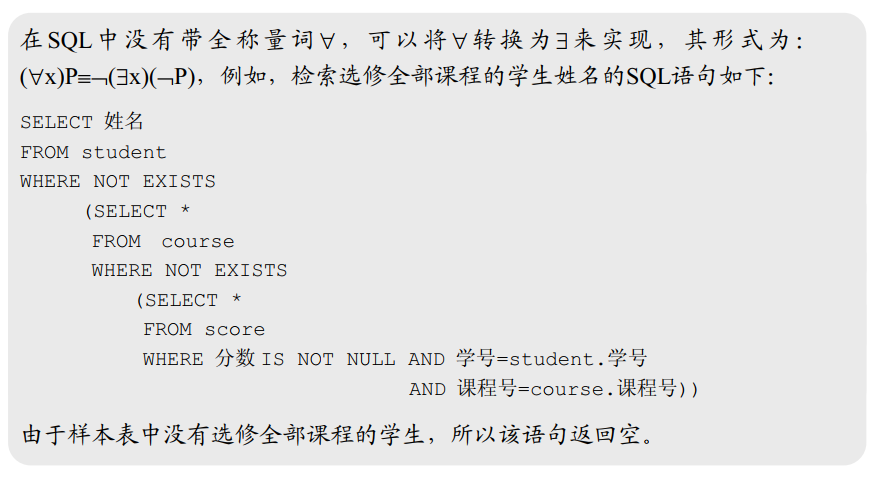


condition join 条件连接

equi-join 等值连接（equalities）

Natural join 自然连接


Relational Calculus 关系演算

> sql语言是建立在关系演算（利用谓词逻辑）基础上实现的。
>
> 关系演算是非过程性的，关系代数是过程性的。

Tuple relational calculus (TRC)元组关系演算

 Domain relational calculus(DRC)域关系演算

> 元组关系演算和域关系演算基本上是一致的，不	同的是对于变量的定义。
>
> 对于域关系演算的定义可以写成:
>
> { <x1,x2, …, xn> | P(x1,x2,…,xn,xn+1,…, xn+m) }
>
> 而对于元组关系演算的定义可以写成：
>
>  { t[<*attribute list>*] | P(t)}


Structured Query Language（Standard Query Language），SQL的全称，结构化查询语言（标准化查询语言）  

- Data Definition Language (DDL)：数据定义语言
- Query Language (QL)：查询语言
- Data Manipulation Language (DML)：数据操作语言
- Data Control Language (DCL)：数据控制语言


Base table 基表

View 视图（虚表）

Data type supported 支持的数据类型

NULL，null，空

UNIQUE，unique，唯一，不允许重复。

DEFAULT，default，默认，如果没有指定的话，那就用defalut定义的值来定义

PRIMARY KEY，primary key，主键

FOREIGN KEY，foreign key，外键

CHECK (Integration Constraint)，完整性约束检查。  


> distinct 清晰的; 清楚的; 明白的; 明显的; 截然不同的; 有区别的; 不同种类的; 确定无疑的; 确实的; 确切的;
>
> 这个用于查询数据中用于消除重复的结果集，放在selecte后面


UNION，union，并

INTERSECT，intersect，交，相交

Nested Queries，嵌套查询

- 关联查询
- 非关联查询

> - 非关联嵌套子查询：
>
>     ```sql
>     SELECT S.sname
>     FROM Sailors S
>     WHERE S.sid IN (SELECT R.sid
>                     FROM Reserves R
>                     WHERE R.bid=103)
>     ```
>
>     非关联嵌套子查询：也就是后面查询出来的数据集合是关于sid的数据集，然后用 ' S.sid in 数据集 ' 的形式判断sid是否满足条件。
>
> - 关联嵌套子查询(  Nested Queries with Correlation  )
>
>     ```sql
>     SELECT S.sname
>     FROM Sailors S
>     WHERE EXISTS (SELECT *
>                   FROM Reserves R
>                   WHERE R.bid=103 AND S.sid=R.sid)
>     ```
>
>     这个理解起来有点类似于循环，将外层的S.sid作为其中循环的一个变量，然后用某一个S.sid分别去和内层的查询进行比较，查找出满足条件的。
>
>     【注意】这里可能也会使用 `NOT IN`，或者`NOT EXISTS` 
>
>     
>
>     ```sql
>     # Find ids of boats which are reserved by only one sailor
>     # 查询只订过一条船的水手
>     SELECT bid
>     FROM Reserves R1
>     WHERE bid NOT IN (  SELECT bid
>                       FROM Reserves R2
>                       WHERE R2.sid ¬= R1.sid)       
>     ```


Division in SQL ，sql中的除法。

> Solution 1:  解决方案一
>
> 否定之否定
>
> ```sql
> SELECT S.sname
> FROM Sailors S
> WHERE NOT EXISTS ((SELECT B.bid
>                    FROM Boats B)
>                   EXCEPT
>                   (SELECT R.bid
>                    FROM Reserves R
>                    WHERE R.sid=S.sid))
> ```
>
> Solution 2:  解决方案二
>
> ```sql
> SELECT S.sname
> FROM Sailors S
> WHERE NOT EXISTS (SELECT B.bid
>                   FROM Boats B
>                   WHERE NOT EXISTS (SELECT R.bid
>                                     FROM Reserves R
>                                     WHERE R.bid=B.bid
>                                     AND R.sid=S.sid))
> ```
>
> 用英文来理解上面的sql2
>
> ```sql
> Sailors S such that ...
>                     there is no boat B without ...
>                                         a Reserves tuple showing S reserved B  
> ```


Aggregate Operators 聚合操作


数据库中的having语句和group by 语句里面的问题

select语句里面的属性与having 里面的属性必须是group by语句里面属性的子集。


```sql
--- Find those ratings for which the average age is the minimum over all ratings  
--- 查询所有平均年龄最小的级别

--- 错误的：
--- Aggregate operations cannot be nested! 
SELECT S.rating
FROM Sailors S
WHERE S.age = (SELECT MIN (AVG (S2.age))
               FROM Sailors S2)
--- 这里的聚合函数不能够嵌套，也就是说MIN(AVG(age))，这种用法是错误的               

--- 正确的做法是：
--- 生成一个临时对照表Temp，其结构为：Temp[ rating , AVG(age) ]

--- 可以两步：先生成一个临时表，然后再查询这个临时表

--- 或者一步到位：
--- 将FROM中的SELECT查询出来的结果集，重新命名为Temp，然后提供给其他使用。
SELECT Temp.rating
FROM (SELECT S.rating, AVG (S.age) AS avgage
      FROM Sailors S
      GROUP BY S.rating) AS Temp
WHERE Temp.avgage = (SELECT MIN (Temp.avgage)
                     FROM Temp)      
               

--- 可以去看王能斌书上的select的详细语法图，这个可以看看，然后结合查询去理解。

```


CAST expression ，cast表达式，有点类似于强制类型转换。

CASE expression，case表达式

```sql
--- 简单例子
---表：Officers (name, status, rank, title)

SELECT name, CASE status
                WHEN 1 THEN ‘Active Duty’  # 可以理解为当status=1时，返回’Active Duty‘
                WHEN 2 THEN ‘Reserve’
                WHEN 3 THEN ‘Special Assignment’
                WHEN 4 THEN ‘Retired’
                ELSE ‘Unknown’
           END AS status
FROM Officers ;


--- 另一个例子
---：Machines (serialno, type, year, hours_used, accidents)

--- Find the rate of the accidents of “chain saw” in the whole accidents 
--- 查询类型为“chain saw”这个设备出现故障的时间占所有故障时间的比是多少？


--- 对于分母而言，如果类型是“chain saw”，那么返回这个故障时间，否者返回“0”；
--- 从而求出类型是chain saw的故障总时间。

SELECT sum (CASE
                WHEN type=‘chain saw’ THEN accidents
                ELSE 0e0
                END) / sum (accidents)
FROM Machines;
```


Sub-query，子查询

- Scalar sub-query，标量子查询，子查询出来的数据是一个简单的值，比如’平均收入‘这样的。

- Table expression，表表达式，子查询出来的数据是一个表数据集。

- Common table expression，公共表表达式。一个公共表表达式相当于一个临时视图。通过with来使用。

    ```sql
    --- 创建一个公共表表达式，其中数据约束为payroll(deptno,totalpay),然后数据来自于后面的select
    WITH payroll (deptno, totalpay) AS
    (SELECT deptno, sum(salary)+sum(bonus)
     FROM emp
     GROUP BY deptno)
    
    --- 使用上面定义的payroll这个公共表表达式
    SELECT deptno
    FROM payroll
    WHERE totalpay = (SELECT max(totalpay)
                      FROM payroll);
    ```

Outer Join，外连接

```sql
--- 两张表：
Teacher ( name, rank )
Course (subject, enrollment, quarter, teacher)

-------------------------------------------------------------
--- 定义公共表表达式。
WITH
--- 这个是有课上的老师表（姓名，职称，开的课程，课程选修人数）
innerjoin(name, rank, subject, enrollment) AS	
                            (SELECT t.name, t.rank, c.subject, c.enrollment
                             FROM teachers AS t, courses AS c
                             WHERE t.name=c.teacher AND c.quarter=‘Fall 96’) ,

--- 没课上的老师表（姓名，职称）
teacher-only(name, rank) AS 
                            (SELECT name, rank
                             FROM teachers
                             EXCEPT ALL
                             SELECT name, rank
                             FROM innerjoin) ,
--- 没有开的课表（开的课程，课程选修人数）
course-only(subject, enrollment) AS
                            (SELECT subject, enrollment
                             FROM courses
                             EXCEPT ALL
                             SELECT subject, enrollment
                             FROM innerjoin)
-------------------------------------------------------------
--- 用上面三张临时表来拼接最终结果，也就是两张表的外连接的数据。
    SELECT name, rank, subject, enrollment
    FROM innerjoin
UNION ALL
    SELECT name, rank,
                        CAST (NULL AS Varchar(20)) AS subject,
                        CAST (NULL AS Integer) AS enrollment
    FROM teacher-only
UNION ALL
    SELECT  CAST (NULL AS Varchar(20)) AS name,
            CAST (NULL AS Varchar(20)) AS rank,
    subject, enrollment
    FROM course-only ;

```

Recursion，递归查询，再公共表表达式中使用了自己，就是递归查询

```sql
--- 表数据：FedEmp (name, salary, manager)

--- 查找在Hoover手下所有手下下面薪水大于100000的人。
WITH agents (name, salary) AS
        ((SELECT name, salary   			--- initial query,把第一级手下先求出来。
          FROM FedEmp
          WHERE manager="Hoover")
 UNION ALL
         (SELECT f.name, f.salary   		--- recursive query，递归体
          FROM agents AS a, FedEmp AS f
          WHERE f.manager = a.name))
  
SELECT name							 		--- final query
FROM agents
WHERE salary>100000 ;

```


Data Manipulation Language（DML），数据操纵语言

- Insert：Insert a tuple into a table

    ```sql
    INSERT INTO EMPLOYEES VALUES ('Smith', 'John','1980-06-10', 'Los Angles', 16, 45000);
    ```

- Delete（Delete tuples fulfill qualifications）

    ```sql
    DELETE FROM Person WHERE LastName = 'Rasmussen' ;
    ```

- Update（Update the attributes’ value of tuples fulfill qualifications）

    ```sql
    UPDATE Person SET Address = 'Zhongshan 23', City = 'Nanjing' WHERE LastName = 'Wilson';  
    ```


View（视图）

- General View，一般视图

    一般视图的定义：（定义形式在数据库中是有的，但是数据是当需要的时候临时计算的）

    ```sql
    CREATE VIEW YoungSailor AS
                                SELECT sid, sname, rating
                                FROM Sailors
                                WHERE age<26;
    
    CREATE VIEW Ratingavg AS
                                SELECT rating, AVG(age)
                                FROM Sailors
                                GROUP BY rating;
    
    ```

- Temporary View，临时视图

    通过`WITH`定义，之前的递归查询里面用了WITH定义的临时视图


Stored Procedure，存储过程

```sql
EXEC SQL
    CREATE PROCEDURE drop_student
        (
            IN student_no CHAR(7),---输入参数
            OUT message CHAR(30)---输出参数
        )
    BEGIN ATOMIC
        DELETE FROM STUDENT
        	WHERE SNO=student_no;
        DELETE FROM SC
        	WHERE SNO=student_no;
        SET message=student_no || ’droped’;
    END;
EXEC SQL
```


# Database Management Systems（数据库管理系统）

## The Architecture of DBMS，数据库管理系统的体系结构

### The components of DBMS core，DBMS的内核的组件


- parser，编译器，词法语法分析器
- grant checking，授权检查
- semantic analysis and query treatment（DDL，QL，DML，DCL）：语义分析和查询处理
- Concurrency control，并发控制
- access management，访问管理
- recovery mechanism，恢复机制
- access primitive，访问原语


### The process structure of DBMS，DBMS的进程结构

- Single process structure，单进程结构
- Multi processes structure，多进程结构
- Multi threads structure，多线程结构
- Communication protocols between processes/ threads  在进程/线程之间的沟通协议


daemon： n. 半神半人的精灵;守护神;恶魔;

【计算机】守护进程，一个特殊的线程，监控作用。在操作系统中起监控作用的。

## Database Access Management，数据库的访问管理

The access to database is transferred to the operations on files (of OS) eventually. The file structure and access route offered on it will affect the speed of data access directly. It is impossible that one kind of file structure will be effective for all kinds of data access.  

> 访问数据库的操作最后转换为对操作系统的文件操作。文件结构和访问路径将会直接影响数据的访问速度。用一种文件结构高效的访问所有数据这是不现实的。

### Access types，访问类型

- Query all or most records of a file (>15%)，查询所有或者文件的大量记录（大于15%）
- Query some special record，查询一些特定的记录，比如查学号为xxx的学生
- Query some records (<15%)
- Scope query，范围查询
- Update  

### File organization，文件组织结构（文件存储结构）

- Heap file：堆文件，随着数据的不断增加，在文件末尾堆。
- Direct file：hash文件（静态的），通过计算hash值存数据
- Indexed file：index + heap file/cluster，索引文件【 cluster（簇集），物理存储在一起】，将文件存成堆文件，然后利用B+树来对一些特定的属性建立索引。
- Dynamic hashing：动态哈希文件，随着文件数据记录的增减，调整hash表的大小。
- Grid structure file：栅格结构文件，利用多维数组的形式存储数据
- Raw disk：一般都是通过操作系统去实现文件的物理存储，但是这个raw disk可以让用户去控制数据文件的物理存储如何存。

### Index technique，索引技术

- B+ Tree (√ √)，
- Clustering index ( √ )
- Inverted file，倒排文件
- Dynamic hashing
- Grid structure file and partitioned hash function
- Bitmap index (used in data warehouse)，位图索引，在数据仓库系统（只读）用的多
- Others  

### Access primitives，访问原语

> 研究生上的课里面的ppt里面有访问原语。东南大学徐立臻的研究生上的课。NITDB系统。。。

## Query Optimization，查询优化

### Algebra Optimization，代数优化

等价变换：将投影和选择操作尽可能地往下压，让二元运算（连接）地两个操作尽可能地少。


实现连接操作地方法：

代价估算：


query tree：查询树

Leaves: relations  === 树叶是关系表
Middle nodes: unary/binary operations
Leaves ---> root: the executing order of operations  


The equivalent transform rules of relational algebra，关系代数的等价变换规则

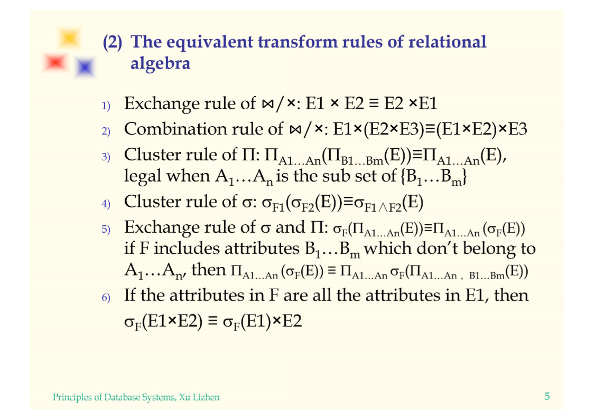

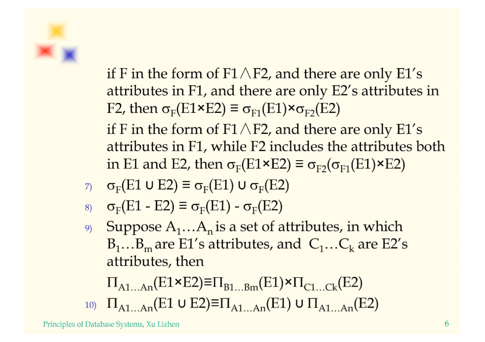

Combination：结合

cluster：簇集，cluster rule，串接律


Basic principles，基本原则

The target of algebra optimization is to make the scale of the operands which involved in binary operations be as small as possible ：

- Push down the unary operations as low as possible
- Look for and combine the common sub-expression

> 代数优化的目标是使涉及二元操作的操作数的规模尽可能小:
>
> - 将一元操作推到尽可能低的位置
>
> - 查找并组合公共子表达式

### Operation Optimization，操作优化

How to find a “good” access strategy to compute the query improved by algebra optimization is introduced in this section:

- Optimization of select operation，选择操作的优化
- Optimization of project operation，投影操作的优化
- Optimization of set operation，集合运算操作的优化
- Optimization of join operation，连接运算操作的优化
- Optimization of combined operations，组合操作的优化


主要考虑对于join操作的优化。

Nested loop，嵌套循环，嵌套循环中需要读取文件，也就是I/O，不需要每条记录调用一次I/O，那就使一次I/O读取多条记录（一个物理块，physical block）。

Merge scan，归并扫描

Using index or hash to look for mapping tuples，使用索引或散列查找映射元组，这个使用的最多。

Hash join，散列连接


## Transaction Management，事务的管理

### Recovery，恢复

The main roles of recovery mechanism in DBMS are:

1. Reducing the likelihood of failures (prevention)
2. Recover from failures (solving)

> DBMS中恢复机制的主要作用是:
>
> (1)降低失败的可能性(预防)
>
> (2)故障恢复(解决)


方法：

1. Periodical dumping，周期性的转储。每个周期将数据转储一次。一般这个周期都会比较长，但是对于这个周期的数据容易丢失，于是可以改进：

    Variation : Backup + Incremental dumping，变体:备份+增量转储

2. Backup + Log，


### Transaction，事务


A transaction T is a finite sequence of actions on DB exhibiting the following effects:

- Atomic action: Nothing or All.
- Consistency preservation: consistency state of DB ---> another consistency state of DB.
- Isolation: concurrent transactions should run as if they are independent each other.
- Durability:The effects of a successfully completed transaction are permanently reflected in DB and recoverable even failure occurs later.  

> 事务的ACID特性，原子性（Atomic），一致性（Consistency ），隔离性（Isolation），持久性（Durability）。

```sql
Begin transaction
    read A
    A:=A-s
    if A<0 then 
    	Display “insufficient fund”
		Rollback /*undo and terminate */
    else B:=B+s
        Display “transfer complete”
        Commit /*commit the update and terminate */       

Rollback --- abnormal termination. (Nothing),回滚，啥也不干
Commit --- normal termination. (All)，提交，事务执行完成
```


nonvolatile storage，非挥发性存储器，像硬盘等断电信息还存在的存储器


Commit Rule and Log Ahead Rule（提交规则和日志先记后写规则）


Recovery strategies，恢复策略，利用日志中的B.I和A.I进行恢复，即对B.I和A.I进行redo和undo操作。

- undo，对一个数据对象undo若干次，其结果等价于一次undo
- redo，对一个数据对象redo若干次，其结果等价于一次redo


Three kinds of update strategy，三种更新策略

- A.I→DB before commit
- A.I→DB after commit
- A.I→DB concurrently with commit


check point，检查点


### Concurrent Control，并发控制

Introduction
In multi users DBMS, permit multi transaction access the database concurrently.

Why concurrency?

1. Improving system utilization & response time.
2. Different transaction may access to different parts of database.

Problems arise from concurrent executions  


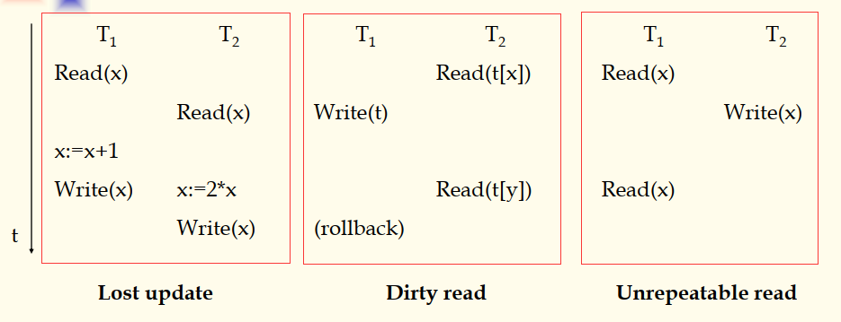


lost update：丢失更新（read-read）

dirty read：脏读（write-read）

unrepeatable read：不可重复读（read-write）


Serialization --- the criterion for concurrency consistency  

序列化（串行化）——并发一致性的标准

Definition: suppose {T1,T2,…Tn} is a set of transactions executing concurrently. If a schedule of {T1,T2,…Tn} produces the same effect on database as some serial execution of this set of transactions, then the schedule is serializable.  

> 定义:假设{T1,T2，…Tn}是一组并发执行的事务。如果一个调度{T1,T2，…Tn}在数据库上产生的效果与连续执行（串行执行）这组事务执行效果相同，那么这个调度是可序列化的。
>
> 
>
> n个事务串行一般有n！种可能的串行序列，对于数据库关系系统而言，如果对事务的并发的调度是一种可串行化的调度执行顺序的话，那就说明这种调度的执行结果是正确的。


#### Locking Protocol，封锁协议

##### 第一种锁协议，X

X locks，Exclusive lock，排他锁，对于只有一种类型的锁，加这个锁可以申请读和写的操作。


对于相容矩阵，行表示在数据对象上已经有的锁，列表示事务想要在该数据上继续申请锁。

NL：no lock，没有锁

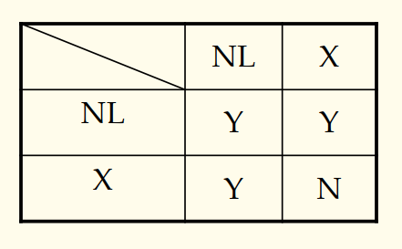


Definiton1：In a transaction, if all locks precede all unlocks, then the transaction is called two phase transaction. This restriction is called `two phase locking protocol`.

Definition2: In a transaction, if it first acquires a lock on the object before operating on it, it is called `wellformed`.

Theorem: If S is any schedule of wellformed and two phase transactions , then S is serializable.

> 定义1：在一个事务中，如果所有的加锁请求都在所有的锁释放之前，那么这个事务被称为两阶段事务。这种限制称为两阶段锁定协议。
>
> |                             2PL                              |                           not 2PL                            |
> | :----------------------------------------------------------: | :----------------------------------------------------------: |
> | 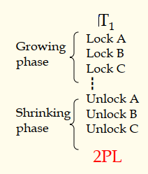 | 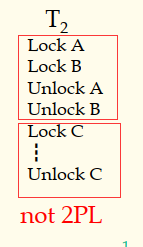 |
>
> 2PL，two phase locking protocot，两阶段加锁协议
>
> growing phase：增长阶段
>
> shrinking phase：缩减阶段
>
> 
>
> 定义2：在一个事务中，如果它在操作对象之前先获得了对象上的锁，它被称为`格式良好的`（这个翻译不是很好，wellformed）。
>
> 
>
> 定理：如果s是一组wellformed的，并且是two phase locking 的，那么s就是可序列化的。
>
> 举个例子，如果对于n个事务{T1,T2，…Tn}，对于其中的每一个事务，如果事务满足wellformed并且是two phase locking 的，那么这n个事务是可串行的（可序列化的）

那么对于上面的总结：

1. Well-formed + 2PL : serializable
2. Well-formed + 2PL + unlock update at EOT: serializable and recoverable. (without domino phenomena)
3. Well-formed + 2PL + holding all locks to EOT: strict two phase locking transaction.  

> 一组事务中，对于一个事务
>
> 1. 是well-formed并且2PL的话，那么这组事务的调度一定是可序列化的。
> 2. 是well-formed和2PL，并且把更新操作的锁推迟到事务结束的时候释放，那么这种调度是可序列化的，并且是可以恢复的。（消除多米诺现象，这个是对于前面的dirty read的一种连锁反应。）
> 3. 是well-formed和2PL，并且把所有的锁的推迟到事务的结束释放，这就是严格的两段加锁协议。


##### 第二种锁协议(S,X)

(S,X) locks；（share，Exclusive）lock；（共享，排他）锁

- S lock --- if read access is intended.  如果需要读的访问。
- X lock --- if update access is intended.  如果需要更新，也就是写操作的时候。

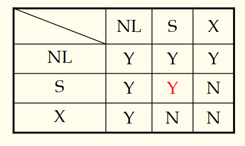


##### 第三种锁协议(S,U,X)

(S,U,X) locks，（share，update，exclusive），（共享，更新，排他）

U lock --- update lock. For an update access the transaction first acquires a U-lock and then promote it to X-lock.
Purpose: shorten the time of exclusion, so as to boost concurrency degree, and reduce deadlock.

> u lock，更新锁，对于更新访问，事务首先获取u锁，当需要真正的写数据的时候再提升为x（排他）锁
>
> 目的：缩短排除时间，从而提高并发度，减少死锁。

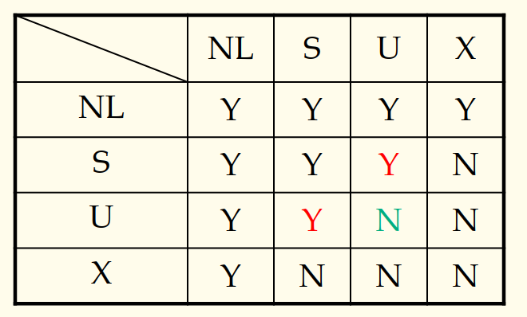


#### Deadlock & Live Lock，死锁和活锁

Live lock，活锁，有时候也称之为 “饥饿” 现象。


解决方法：可以类似于操作系统中的进程的死锁和饥饿现象的处理

live Lock：这个解决方法简单，只要调整调度策略就行

对于deadlock，有（1）防，（2）治两种方法。


# The Security and Integrity Constraints（安全性与完整性约束）

安全。。。看ppt


## Integrity Constraints，完整性约束


### Types of Integrity Constraints，完整性约束的类型

- Static constraints: constraints to database state 
    - Inherent constraints (data model), such as 1NF
    - Implicit constraints : implied in data schema, indicated by DDL generally. Such as domain constraints, primary key constraints, foreign key constraints.
        - 
            Domain constraints:  Field values must be of right type. Always enforced.
    - Explicit constraints or general constraints
- Dynamic constraints:  constraints while database transferring from one state to another. Can be combined with trigger.

> - 静态约束:对数据库状态的约束
>     - 固有约束(数据模型)，如1NF
>     - 隐式约束:隐含在数据模式中，通常由DDL表示。如域约束、主键约束、外键约束。
>         - 域约束:字段值必须为right类型。总是执行。
>     - 显式约束或一般约束
> - 动态约束:数据库从一个状态转移到另一个状态时的约束。可与触发器结合使用。

定义一个断言，assert，

创建表的时候利用check子句来定义完整性约束


## Definition of Integrity Constraints，定义完整性约束

- Indicated with procedure

    Let application programs responsible for the checking of integrity constrains.

- Indicated with *ASSERTION*

    Defined with *assertion specification language*, and checked by DBMS automatically

    ```sql
    --- balanceCons是表名，account是一个字段
    ASSERT balanceCons ON account: balance>=;
    ```

- Indicated with *CHECK* clause in base table definition, and checked by DBMS automatically

    - Useful when more general ICs than keys are involved.

    - Can use queries to express constraint.

    - Constraints can be named.

        ```sql
        CREATE TABLE Sailors
        	( 
                sid  INTEGER,
                sname  CHAR(10),
                rating  INTEGER,
                age  REAL,
                PRIMARY KEY  (sid),
                CHECK  ( rating >= 1 AND rating <= 10)---这个约束rating是1~10的
            );
        
        CREATE TABLE  Reserves
        	(
                sname  CHAR(10),
                bid  INTEGER,
                day DATE,
                PRIMARY KEY  (bid, day),
                ---定义约束名字为noTnterlakeRes，功能再check里面
                CONSTRAINT  noInterlakeRes CHECK  (   
                    ‘Interlake’ <>( ----这里的‘<>’等价于‘!=’,不等于
                        SELECT  B.bname
                        FROM  Boats B
                        WHERE  B.bid=bid
                    )
                )
            )
        ```

        

> Indicated：表示
>
> procedure：程序，过程
>
> clause：子句，条款
>
> involved：涉及，包含
>
> constraint：约束


## Triggers，触发器，触发子

- Trigger: procedure that starts automatically if specified changes occur to the DBMS
- Three parts:
    - `E`vent (activates the trigger)
    - `C`ondition (tests whether the triggers should run)
    - `A`ction (what happens if the trigger runs)
- Active database rules (ECA rules)

> 触发器：当DBMS发生指定的更改时会自动启动的过程
>
> 三个部分:
>
> - 事件(激活触发器)
>
> - 条件(测试触发器是否应该运行)
>
> - 动作(如果触发器运行会发生什么)
>
>
> 主动数据库规则(ECA规则，也就是  “事件--条件--动作”  规则)

### 触发器的语法

去看一下书上的定义和形式。


Triggers: Example (SQL:1999)

```sql
CREATE TRIGGER youngSailorUpdate	---创建一个trigger，名为youngSailorUpdate
AFTER INSERT ON SAILORS				---监视水手表
REFERENCING NEW TABLE NewSailors	---将新插入的值当作一张NewSailors表
FOR EACH STATEMENT
INSERT INTO YoungSailors(sid, name, age, rating)
		SELECT sid, name, age, rating	---查询出value
		FROM NewSailors N
		WHERE N.age <= 18
```


# Database Design，数据库设计

## Data Dependency and Normalization of Relational Schema，关系模式的数据依赖性和规范化

Some dependent relations exist between attributes.

`Function dependency (FD)`: the most basic kind of data dependencies. The value of one or a group attributes can decide the value of other attributes.

 FD is the most important in general database design.

`Multi-valued Dependency (MVD)`: the value of some attribute can decide a group of values of some other attributes.

`Join Dependency (JD)`: the constraint of lossless join decomposition.

> 属性之间存在一些依赖关系。
>
> - “函数依赖(FD)”：最基本的数据依赖。一个或一组属性的值可以唯一的决定其他属性的值。
>
>     ​	FD是通用数据库设计中最重要的部分。
>
> - “多值依赖(MVD)”：某个属性的值可以决定其他属性的一组值。
>
> 【注意】多值依赖是一个值决定一组值，而函数依赖是多值依赖的一个特例，也就是一个值唯一确定一个值。
>
> - “连接依赖(JD) ”：无损连接分解的约束。


> 无损连接分解：SPJ( S# , P# , J# )通过投影操作，拆分成三个表：( S# , P# ) , ( P# , J# ) , ( J# , S# )
>
> 如果将后面三个表进行连接操作，能够完完全全等价于之前的表数据，那么称这种分解操作称为无损连接操作。
>
> 如果将SPJ能够实现一个无损分解的话，那么把这些个分解属性称为连接依赖。
>
> 【注】在实际应用中，多值依赖以及无损连接分解很少。。
>
> 这个可以说是双向决定，也就是说a决定b，b决定a，那么对于（a , b）可以无损分解为（a）（b）


## 关系模式的范式理论

###  `1 NF`，first normal form，一范式

every attribute of a relation must be atomic.

每一个属性都是原子的。

###  `2 NF`，second normal form，二范式

R∈1NF and no partially function dependency exists between attributes.

如果关系R属于一范式，并且对于关系R中不存在对主键的部分函数依赖


```sql
 S(S#, SNAME, AGE, ADDR, C#, GRADE) --- non 2NF
```

首先由于主键是（S#，C#）-->grade，但是对于（sname，age，addr）属性可以只有S#决定，也就是说存在一个主键的部分函数依赖，S#-->（sname，age，addr）

Problems of non 2NF，不满足2范式建立的数据库表可能出现的问题，以上面的数据库表为例

- Insert abnormity: can not insert the students’ information who have not selected course.
- Delete abnormity: if a student unselect all courses, his basic information is also lost.
- Hard to update: because of redundancy, it is hard to keep consistency when update.	

> 插入异常：不能插入未选课学生的信息。
>
> 删除异常：如果学生取消了所有课程的选择，其基本信息也丢失了。
>
> 难以更新：由于存在冗余，更新时很难保持一致性。


Resolving：解决方法

 According to the rule of `“one fact in one place”` to decompose the relation into 2 new relations:

```sql
 S(S#, SNAME, AGE, ADDR)
 SC(S#, C#, GRADE)
```

> 根据`一事一地`的1原则将关系分解为两个新的关系


###  `3 NF`，Third normal form，三范式

R∈2NF and no transfer function dependency exists between attributes.

关系R属于2范式，并且没有任何的属性对主键的传递依赖。

比如：

```sql
EMP(EMP#, SAL_LEVEL, SALARY)  --- non 3NF
```

对于EMP表中，EMP#---->SAL_LEVEL---->SALARY（职工编号确定了，职工级别也就确定了，那么工资也就确定了）

Problems of non 3NF：

- Insert abnormity: before the employees’s sal_level are decided, the correspondence between sal_level and salary can not input.
- Delete abnormity: if some sal_level has only one man, the correspondence between sal_level and salary of this level will be lost when the man is deleted.
- Hard to update: because of redundancy, it is hard to keep consistency when update.

> 插入异常：在员工sal_level确定之前，不能输入sal_level与工资的对应关系。
>
> 删除异常：如果某个sal_level只有一个man，删除该man时，sal_level与该level的salary之间的对应关系将丢失。
>
> 难以更新:由于存在冗余，更新时很难保持一致性。也就是（sal_level , salary）会存储冗余


Resolving：解决方法

 According to the rule of `“one fact in one place”` to decompose the relation into 2 new relations:

```sql
EMP(EMP#,SAL_LEVEL)
SAL(SAL_LEVEL,SALARY)
```

> 也是根据`一事一地`的原则将关系分解为两个新的关系


### `BCNF`，Boyce Codd Normal Form

这个和3NF很接近，但是比3NF要严格一点，对于关系依赖中的每个关系A--->B,其中决定子A一定是主键。


###  `4 NF`，fourth normal form，四范式

在三范式的基础上，消除属性之间的多值依赖就是四范式


###  `5 NF`，fifth normal form，五范式

在四范式的基础上，消除属性之间的连接依赖就是无范式


## ER Model and ER Diagram，ER模型和ER图

Concept model: entity—relation, be independent of practical DBMS.

Legend：

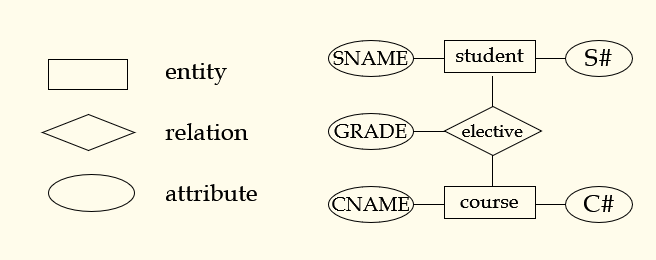

> 概念模型:实体-关系，独立于DBMS。
>
> 说明：


## Database Design Method，数据库设计的方法

### Procedure oriented method，面向过程的方法

This method takes business procedures as center, the database schema is designed basically in accordance directly with the vouchers, receipts, reports, etc. in business. Because of no detailed analysis on data and inner relationships between data, although it is fast at the beginning of the project, it is hard to ensure software quality and the system will be hard to fit future changes in requirement and environment. So this method is not suitable for the development of a large, complex system.

> 该方法以业务流程为中心，基本按照业务中的凭证、单据、报表等直接设计数据库模式。由于没有对数据和数据之间的内在关系进行详细的分析，虽然项目开始的时候速度很快，但是很难保证软件的质量，系统也很难适应未来需求和环境的变化。因此，这种方法不适合开发大型、复杂的系统。

### Data oriented method，面向数据的方法

This method design the database schema based on the detailed analysis on data and inner relationships between data which are involved in business procedures. It takes data as center, not procedures. It can not only fulfill the current requirements, but also some potential requirements. It is liable to fit future changes in requirement and environment. It is recommended in the development of large, complex systems.

> 该方法在对业务过程中涉及的数据和数据之间的内在关系进行详细分析的基础上设计数据库模式。它以数据为中心，而不是过程。它不仅可以满足当前的需求，还可以满足一些潜在的需求。它能够适应未来需求和环境的变化。推荐用于开发大型、复杂的系统。


### database design flow，数据库设计流程

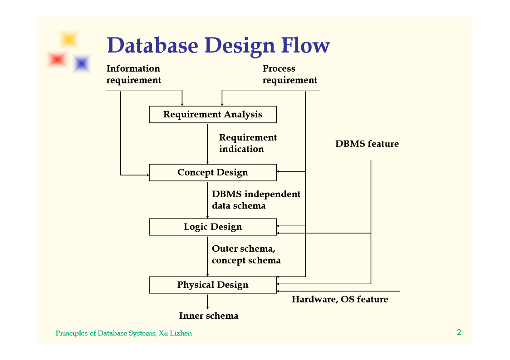

#### Requirement Analysis，需求分析

A very important part of system requirement analysis. In requirement analysis phase, the data dictionary and DFD (or UML) diagrams are the most important to database design. 

- Dictionary and DFD
    - Name conflicts
        - Homonym(the same name with different meanings)
        - Synonym(the same meaning in different names)
    - Concept conflicts
    - Domain conflicts

* About coding
    * Standardization of information
    * Identifying entities
    * Compressing information

**Through requirement analysis, all information must be with unique source and unique responsibility.**

> 系统需求分析的重要组成部分。在需求分析阶段，数据字典和DFD【数据流图】（或UML）对数据库设计是最重要的。
>
> conflicts：冲突
>
> Homonym：同音异义
>
> Standardization：标准
>
> identify：确定，识别
>
> Compress：压缩

#### Concept Design，概念设计

Based on data dictionary and DFD, analyze and classify the data in data dictionary, and refer to the processing requirement reflected in DFD, identify entities, attributes, and relationships between entities. Then we can get concept schema of the database.

- Identify Entities
- Define the relationships between entities
- Draw ER diagram and discuss it with user
    - It is proposed to use ER design tools such as ERWin, Rose, etc.

> 基于数据字典和DFD，对数据字典中的数据进行分析和分类，并参考DFD反映的处理要求，识别实体、属性和实体之间的关系。然后得到数据库的概念架构。
>
> - 确定实体
>
> - 定义实体之间的关系
>
> - 绘制ER图并与用户讨论
>     - 建议使用ERWin、Rose等ER设计工具。

#### Logic Design，逻辑设计

According to the entities and relationships in ER diagram, define tables and views in target DBMS. Basic standard is 3NF.

- Translate entities and relationships in ER diagram to tables
- Naming rule of table and attribute
- Define the type and domain of every attribute
- Suitable denormalization
- Necessary view
- Consider the tables in legacy system
- Interface tables

> 根据ER图中的实体和关系，在目标DBMS中定义表和视图。基本标准为3NF。
>
> - 将ER图中的实体和关系转换为表
>
> - 表和属性的命名规则
>
> - 定义每个属性的类型和域
>
> - 合适的反规范化
>
> - 必要的视图
>
> - 考虑遗留系统中的表
>
> - 接口表

#### Physical Design，物理设计

For relational database, the main task in this phase is to consider creating necessary indexes according to the processing requirements, including single attribute indexes, multi attributes indexes, cluster indexes, etc. Generally, the attribute often as query conditions should have index.

Other problems:

- Partition design
- Stored procedure
- Trigger
- Integrity constraints

> 对于关系数据库，这一阶段的主要任务是根据处理需求考虑创建必要的索引，包括单属性索引、多属性索引、聚类索引等。通常，通常作为查询条件的属性应该具有索引。
>
> 其他问题:
>
> - 分区设计
>
> - 存储过程
>
> - 触发器
>
> - 完整性约束
